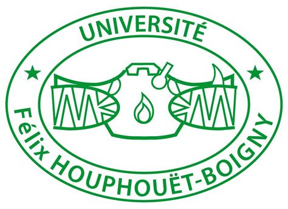
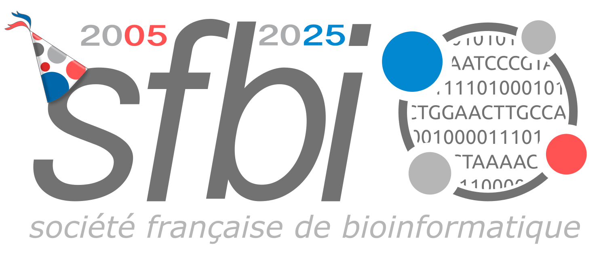
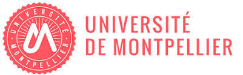
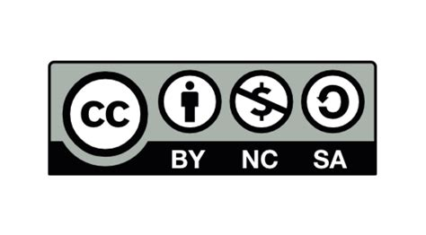

---
layout: default
title: readme
pagination:
  enabled: true
---

## Welcome to the West Africa Bioinformatics Meeeting 2025

 

 

 
 

 

First interdisciplinary meeting of the bioinformatics and systems administration community in West Africa, with a view to creating a West African Bioinformatics Network. 
 

15 - 17 December 2025

 

 

The <a href="https://wave-center.org/" target_blank>WAVE Regional Center of Excellence</a>, Université Félix Houphouët-Boigny, Bingerville, Abdijan

 

 

bioinfo@wave-center.org

 
 
 

 

 
 

 

### License

All material is licensed under the **Creative Commons Attribution 4.0 International License**.

