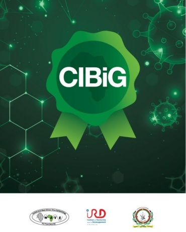

Join us at our International Workshop on Genomics and Bioinformatics — an unmissable event for professionals and enthusiasts on this field. We are proud to collaborate with leading institutions a unique alliance shaping the future of data-driven science in Africa and beyond : 

| Collaborator                | Link                       | Logo |
|----------------------------------------------------|-------------------------------------------------------------------------------------------|------|
| WAVE Regional Center of Excellence                 | [https://wave-center.org/](https://wave-center.org/)                                     |     |
| Félix Houphouët-Boigny University                  | [https://w.univ-fhb.edu.ci/](https://w.univ-fhb.edu.ci/)                                     |     |
| Université Joseph Ki-Zerbo (UJKZ)                  | [https://www.ujkz.bf/](https://www.ujkz.bf/)                                             |     |
| CIBiG (International Certificate in Bioinformatics and Genomics) | [https://github.com/wave-centre/cibig](https://github.com/wave-centre/cibig) |   | 
| Institut Français de Bioinformatique (IFB)         | [https://www.france-bioinformatique.fr/](https://www.france-bioinformatique.fr/)         |   |
| Société Française de Bioinformatique (SFBI)        | [https://www.sfbi.fr/](https://www.sfbi.fr/)                                             |  |
| Master in Bioinformatics, University of Montpellier| [https://formations.umontpellier.fr/fr/formations/master-XB/master-bioinformatique-KKI9GZEV.html](https://formations.umontpellier.fr/fr/formations/master-XB/master-bioinformatique-KKI9GZEV.html) |    |
| Institut de Recherche pour le Développement (IRD)  | [https://www.ird.fr/](https://www.ird.fr/)                                               |   |
| i-Trop Platform                                    | [https://bioinfo.ird.fr/](https://bioinfo.ird.fr/)                                       |    |

### WAVE Regional Center of Excellences

The [WAVE](https://wave-center.org/) (Central and West African Virus Epidemiology) Center, based at Félix Houphouët‑Boigny University in Côte d’Ivoire, focuses on monitoring and managing plant viruses threatening crops like cassava. Launched in 2015 and endorsed by ECOWAS, WAVE operates across 10+ countries, providing research, diagnostics, training (MSc/PhD), and capacity building, with a strong emphasis on empowering women in science.

### Félix Houphouët-Boigny University

Félix Houphouët-Boigny University [UFHB](https://www.ufhb.edu.ci/) is the largest public university in Côte d’Ivoire, located in Abidjan. Founded in 1964, it offers a wide range of programs in science, humanities, law, economics, medicine, and engineering, and hosts several research centers of excellence, including the WAVE Center.

### Joseph Ki-Zerbo University

Located in Ouagadougou, Burkina Faso, the [Université Joseph Ki‑Zerbo](https://www.ujkz.bf/) (commonly UJKZ) is the country's oldest and largest public university, founded in 1974. It offers a wide range of undergraduate to doctoral programs across multiple disciplines and hosts key research units, including a UNESCO Chair on gender, science, and sustainable development.

### The International Certificate in Bioinformatics and Genomics (CIBiG) 

[CIBiG](https://github.com/wave-centre/cibig) (International Certificate in Bioinformatics and Genomics) is a one-month intensive training program for PhD students and researchers working with sequencing and genomic data in health and agriculture. Hosted by the WAVE Center of Excellence in Côte d’Ivoire, it combines theory and hands-on skills in bioinformatics, omics analysis, and reproducible science. The course promotes data-driven research in West Africa through practical modules in Linux, R, Python, and open science tools.

### IFB (Institut Français de Bioinformatique)

The [IFB](https://www.france-bioinformatique.fr/), the Bioinformatics French Institut is a national infrastructure dedicated to bioinformatics. It provides resources and services for research in biology, with a focus on genomic and post-genomic data analysis. The IFB plays a key role in the development and dissemination of bioinformatics tools in France.

### SFBI (Société Française de Bioinformatique)

The [SFBI](https://www.sfbi.fr/) is a learned society that brings together bioinformatics professionals in France. It aims to promote research, education, and applications in bioinformatics. The SFBI organizes conferences, workshops, and training sessions to facilitate exchanges and collaboration among researchers and professionals in the field.

### Master in Bioinformatics, University of Montpellier

The [Bioinformatic Master of Montpellier University - UM](https://formations.umontpellier.fr/fr/formations/master-XB/master-bioinformatique-KKI9GZEV.html) is a high-level program that prepares students for the challenges of modern bioinformatics. This program offers solid training in biology, computer science, and mathematics, enabling students to acquire the skills needed to analyze and interpret complex biological data.

### Institut de Recherche pour le Développement

The [IRD](https://www.ird.fr/) is a French public research institution dedicated to development research. It conducts research projects in various fields, including biology, ecology, and health, in collaboration with international partners. The IRD is committed to producing scientific knowledge to address the challenges of sustainable development.

### i-Trop Platform

The [i-Trop](https://bioinfo.ird.fr/) platform is a bioinformatics facility based at the IRD center in Montpellier. It is part of the South Green platform and the French Institute of Bioinformatics (IFB). The i-Trop platform supports research projects aimed at improving the health and well-being of populations in tropical regions. It offers advanced resources and services for the analysis of biological data. The platform also provides practical training in high-performance computing (HPC) to advanced data analysis like next-generation sequencing data analysis and programming.

