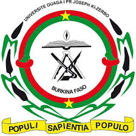
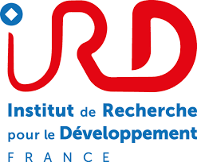
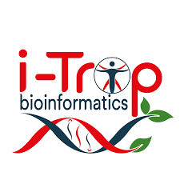
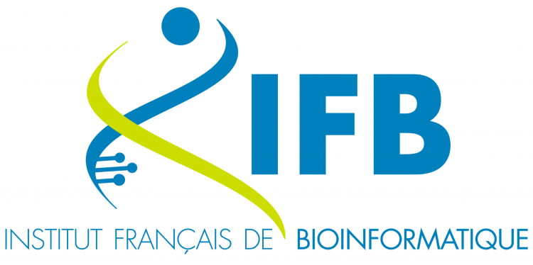

## Meeting of West Africa Bioinformatics community 2025

 

 

 
 

 

Welcome to our international workshop on genomics and bioinformatics, an unmissable event for professionals and enthusiasts in the Bioinformatics field! From December 15 to 17, 2025, in Abidjan, Côte d'Ivoire, this workshop will bring together leading teams from bioinformatics platforms across several West African countries, as well as renowned French institutions. This event is a unique opportunity to enhance your skills, share knowledge and resources, and build a dynamic community around bioinformatics challenges. Don't miss this chance to engage in enriching exchanges, expand your professional network, and contribute to innovative collaborative projects. 

Join us to shape the future of bioinformatics in West Africa!
 

 

15 - 17 December 2025

 

The <a href="https://wave-center.org/" target_blank>WAVE Regional Center of Excellence</a>, Université Félix Houphouët-Boigny, Bingerville, Abdijan

 

## Online meeting attending   
 

You are kindly invited to register for the RABIAS **online meeting**, which will take place via Zoom.
 
Time: Starting at 8:30 AM (UTC)
 
Please make sure to complete your registration before the event begins using the [link zoom](https://us02web.zoom.us/meeting/register/q3exUOEzRqCmWfntFyoWhg)
 
After registering, you will receive a confirmation email containing the instructions to join the meeting.

Join us !

 

bioinfo@wave-center.org

   

  

 

 
